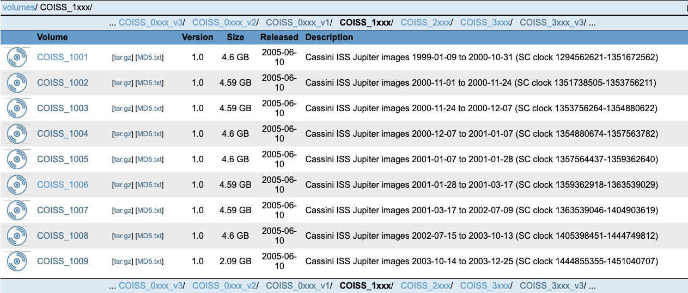
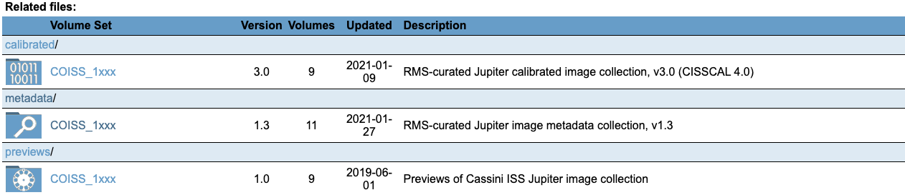
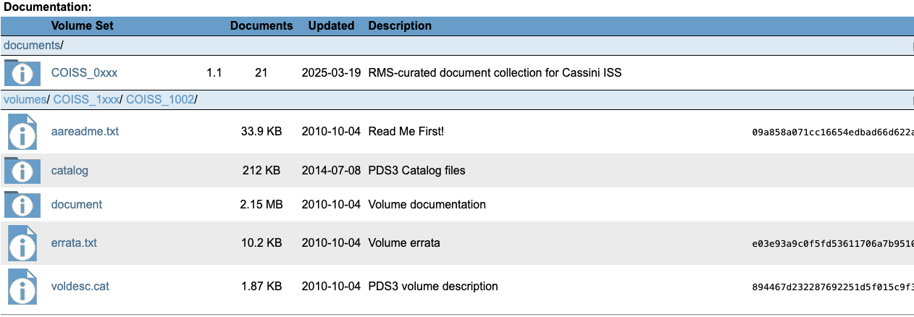
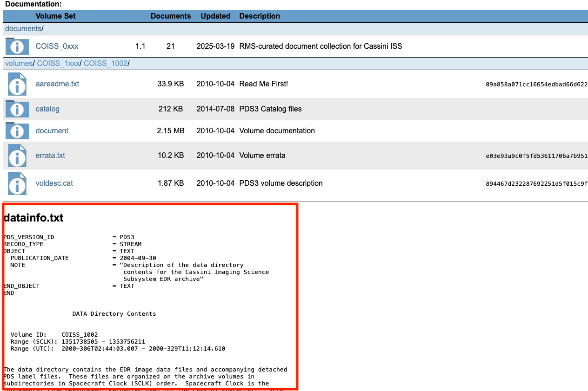
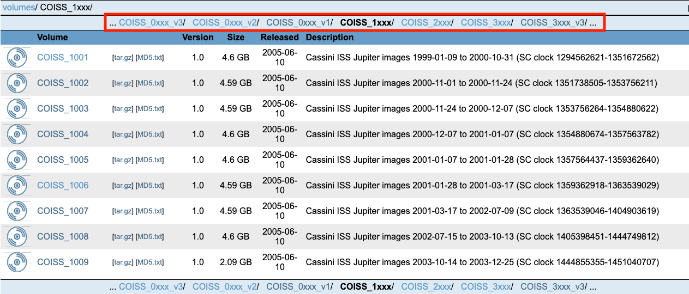

<!-- start-after-point -->

<!-- Add badges once PyPI, GitHub Actions, and Codecov exist -->
<!--
| PyPI Release | Test Status | Code Coverage |
|--------------|-------------|----------------|
| [](https://badge.fury.io/py/rms-viewmaster) | [](https://github.com/SETI/rms-viewmaster/actions) | [](https://codecov.io/gh/SETI/rms-viewmaster) |
-->

# Introduction

`Viewmaster` is a web‑based file and document viewer and management tool. It focuses on handling and displaying various types of PDS documents and folders.

# Getting Started

Environment Setup (first‑time only)

1. Clone the repository:

   ```bash
   git clone https://github.com/SETI/rms-viewmaster.git
   ```

2. Create a virtual environment and install dependencies:

   ```bash
   cd rms-viewmaster
   python -m venv myenv        # Replace "myenv" with your preferred name
   source myenv/bin/activate
   pip install -r requirements.txt
   ```

3. Set the environment variable `PDS3_HOLDINGS_DIR` to the path of your PDS3 holdings directory.

   After symlink resolution (`realpath`), this path **must** end with a directory named `holdings`. The parent of that directory must also contain sibling `shelves/` and `volinfo/` directories:

   ```text
   <prefix>/
     holdings/    ← PDS3_HOLDINGS_DIR points here
     shelves/
     volinfo/
   ```

4. Create the `/var/www/` (Linux) or `/Library/WebServer` (Mac) directory and set the ownership to avoid permission issues when creating logs (Note: log files are under these root directories):

   For Linux:

   ```bash
   sudo mkdir /var/www/
   sudo chown -R user /var/www/   # Replace "user" with your username
   ```

   For Mac:

   ```bash
   sudo mkdir /Library/WebServer
   sudo chown -R user /Library/WebServer   # Replace "user" with your username
   ```

Running Locally

1. Start the server at the root of the repo:

   ```bash
   python -m viewmaster.viewmaster
   ```

2. Open your browser and go to:

   <http://127.0.0.1:8080/>
   *(This corresponds to `VIEWMASTER_PREFIX_` in `viewmaster_config.py`.)*

   The server binds to `127.0.0.1:8080` by default. Override with `VIEWMASTER_HOST` and `VIEWMASTER_PORT` (for example `VIEWMASTER_HOST=0.0.0.0` to listen on all interfaces).

# Viewmaster and `PdsFile` Rules Interface

Viewmaster renders pages by building a `page` dictionary and passing it
to Jinja templates. Most values in this dictionary are derived from
`pdsfile.Pds*File` objects and from bundle-specific rule definitions.

Each Jinja template consumes specific `page[...]` keys to render
different sections of the interface.

A typical Viewmaster page contains three main tables:

1.  Main file table
2.  Related files table
3.  Documentation table

Additional sections include the information panel and neighbor
navigation bar.

------------------------------------------------------------------------

# Rendering Architecture

The overall rendering flow is:

    PdsFile rules
          │
          ▼
    Viewmaster builds page dictionary
          │
          ▼
    Jinja templates render page sections
          │
          ├── Main file table
          ├── Related files table
          ├── Documentation table
          ├── Info section
          └── Neighbor navigation

------------------------------------------------------------------------

# Main File Table

`page['tables']`



## Rendering

Rendered by:

    viewmaster/templates/table_div.html

Within this template:

    tables + associations + documents → all_tables

## Included from

-   `viewmaster/templates/table_view.html`
-   `viewmaster/templates/grid_view.html`
-   `viewmaster/templates/index_rows_view.html`

## Rules affecting this table

### SORT_KEY

- Bundle-specific variable: `sort_key`

- Defines how basenames are ordered. This determines the order of the table rows.

### SPLIT_RULES

- Bundle-specific variable: `split_rules`

- Defines how a basename is split into: anchor/suffix/extension. Files with the same anchor are grouped together. Within a group, ordering is determined by `SORT_KEY`.

### DESCRIPTION_AND_ICON

- Bundle-specific variable: `description_and_icon_by_regex`

- Defines the icon and description displayed for each table row.

These three rules apply to all tables on the page.

------------------------------------------------------------------------

# Related Files Table

`page['associations']`



This table appears under **"Related files:"**.

## Rendering

Rendered by:

    viewmaster/templates/table_div.html

(as part of `all_tables`)

## Rules affecting this table

### ASSOCIATIONS

- Bundle-specific variables: `associations_to_*` (excluding `associations_to_documents`)

- For a given `PdsFile` instance, these rules define which files should
appear in the Related files table.

------------------------------------------------------------------------

# Documentation Table

`page['documents']`



This table appears under **"Documentation:"**.

## Rendering

Rendered by:

    viewmaster/templates/table_div.html

(as part of `all_tables`)

## Rules affecting this table

### ASSOCIATIONS (documents)

- Bundle-specific variable: `associations_to_documents`

- This rule defines which files should appear in the Documentation table
for a given `PdsFile` instance.

------------------------------------------------------------------------

# Info Section

`page['info']`\
`page['info_content']`



## Rendering

Rendered by:

    viewmaster/templates/info_div.html

## Rules affecting this section

### INFO_FILE_BASENAMES

- Defines the file basename whose contents will be rendered at the end of the page when the basename appears in the main table.

------------------------------------------------------------------------

# Neighbor Navigation

Horizontal navigation bar displayed above the first table.



## Rendering

Rendered by:

    viewmaster/templates/neighbor_navigation.html

Included from:

    table_div.html

## Rules affecting this section

### NEIGHBORS

- Defines adjacent directories in the navigation bar. Used when the current page corresponds to: a directory or an index row.

### SIBLINGS

- Defines adjacent files in the navigation bar. Used when the current page corresponds to a file.

------------------------------------------------------------------------

# Summary


  | Page Section     | Page Key               | Main Rules                                         |
  |------------------|------------------------|----------------------------------------------------|
  | Main file table  | `page['tables']`       | `SORT_KEY`, `SPLIT_RULES`, `DESCRIPTION_AND_ICON`  |
  | Related files    | `page['associations']` | `ASSOCIATIONS`                                     |
  | Documentation    | `page['documents']`    | `associations_to_documents`                        |
  | Info section     | `page['info']`         | `INFO_FILE_BASENAMES`                              |
  | Navigation bar   | ---                    | `NEIGHBORS`, `SIBLINGS`                            |


# Contributing

Information on contributing to this package can be found in the
[Contributing Guide](https://github.com/SETI/rms-viewmaster/blob/main/CONTRIBUTING.md).

# Links
<!-- Update the readthedocs link once the branch merged into main -->
- [Documentation](https://rms-viewmaster.readthedocs.io/en/clean_up_viewmaster/)
- [Repository](https://github.com/SETI/rms-viewmaster)
- [Issue tracker](https://github.com/SETI/rms-viewmaster/issues)
<!-- Add this once we make pip install working -->
<!-- - [PyPi](https://pypi.org/project/rms-viewmaster) -->
